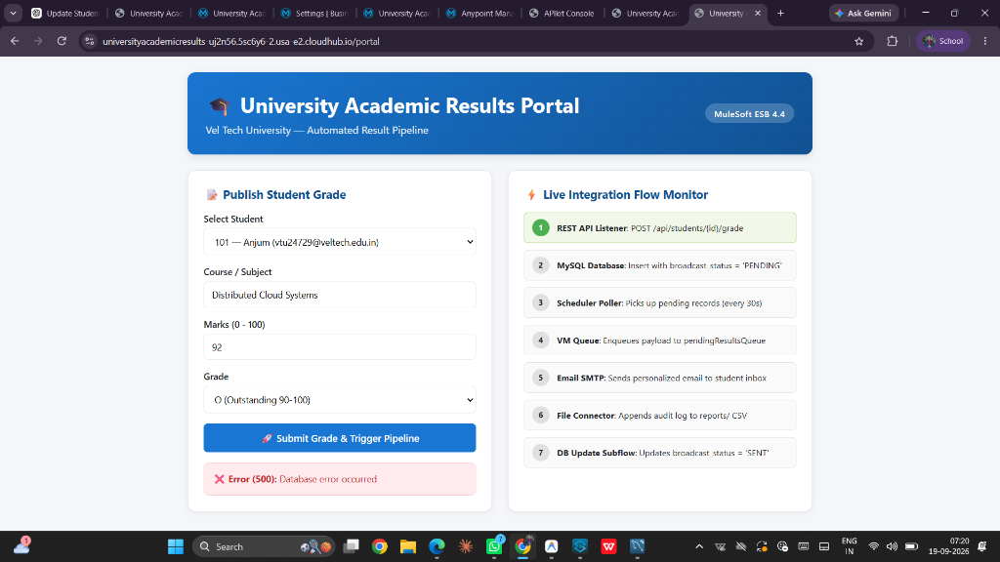
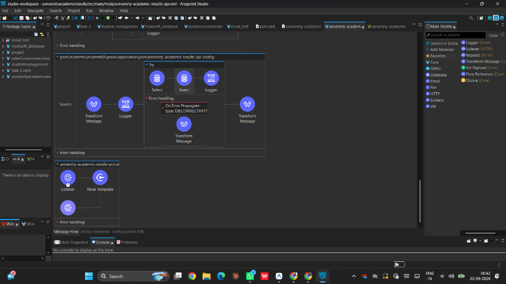
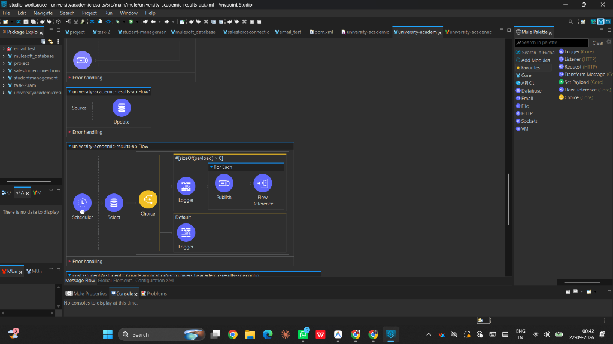
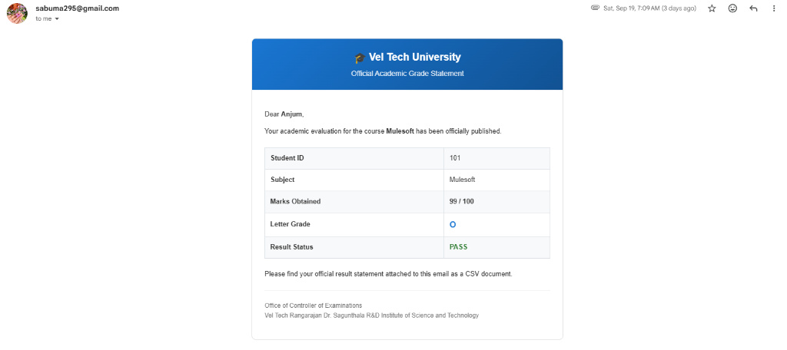
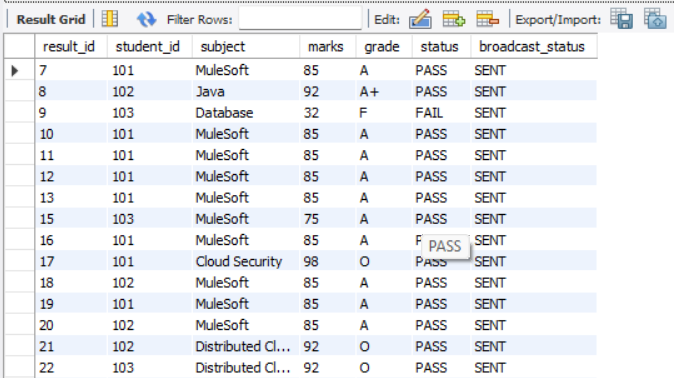
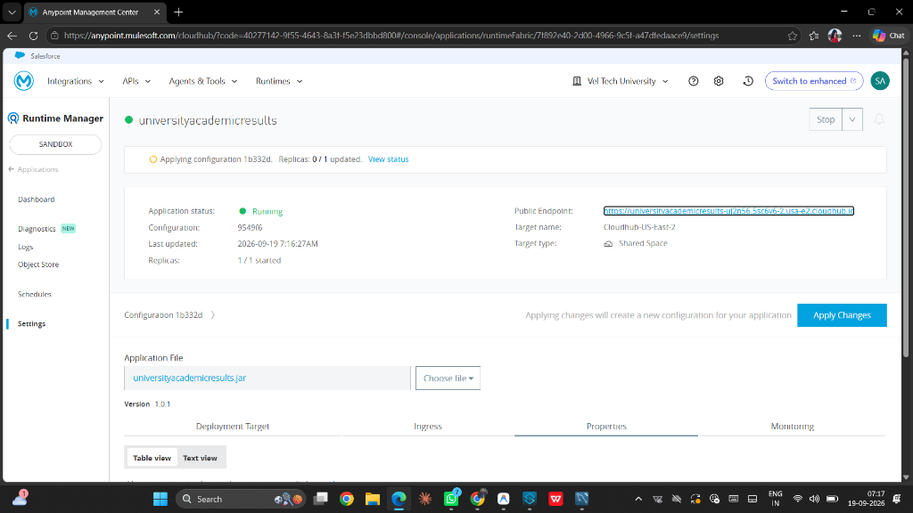

# 🎓 University Academic Results API & Automated Broadcasting System

[](https://www.mulesoft.com/)
[](https://universityacademicresults-uj2n56.5sc6y6-2.usa-e2.cloudhub.io/portal)
[]()
[](https://opensource.org/licenses/MIT)

An enterprise-grade, event-driven academic grading and broadcast integration built on **MuleSoft Anypoint Platform**, **MySQL Database**, **Java VM Queue**, **Gmail SMTP**, and deployed to **CloudHub 2.0 (Shared Space, US East 2)**.

---

## 🌐 Live CloudHub 2.0 Web Portal

Access the live interactive portal deployed on MuleSoft CloudHub 2.0:  
👉 **[https://universityacademicresults-uj2n56.5sc6y6-2.usa-e2.cloudhub.io/portal](https://universityacademicresults-uj2n56.5sc6y6-2.usa-e2.cloudhub.io/portal)**



---

## 🏛️ System Architecture & Workflow

The solution follows an API-led, asynchronous event-driven architecture that decouples web client interactions from database updates and automated notifications:

```
                       +-----------------------------------+
                       |    Interactive Web Portal (UI)    |
                       |    (/portal served by MuleSoft)   |
                       +-----------------+-----------------+
                                         |
                                         | POST /api/students/{id}/grade
                                         v
+---------------------------------------------------------------------------------+
|                               MuleSoft ESB Runtime                              |
|                                                                                 |
|  1. APIkit Router & Autodiscovery (ID: 21182871)                                |
|  2. Try Scope with Error Propagate (DB:CONNECTIVITY)                            |
|  3. MySQL Insert (`broadcast_status = 'PENDING'`)                               |
|                                                                                 |
|  4. Fixed-Frequency Scheduler (30s Poller)                                      |
|     `SELECT ... FROM results r JOIN students s WHERE broadcast_status='PENDING'`|
|                                                                                 |
|  5. VM Queue (`pendingResultsQueue`) — Asynchronous Event Decoupling           |
|                                                                                 |
|  6. VM Listener Broadcast Flow:                                                 |
|     ├── Email Connector: Personalized HTML Grade Card to student's inbox        |
|     ├── Email Attachment: Generated CSV Grade Statement document                |
|     ├── File Connector: Local/Cloud audit CSV log appended                      |
|     └── DB Subflow: Status updated to 'SENT'                                    |
+---------------------------------------------------------------------------------+
```

---

## 📸 Implementation & Studio Canvas

### 1. API Flows, Try-Scope Error Handling & Web Portal Flow
Features API Autodiscovery, URI parameter extraction, transactional database validation inside a Try scope with `DB:CONNECTIVITY` error propagation, and HTTP web portal rendering.



### 2. Asynchronous Polling & VM Queue Decoupling
A 30-second fixed-frequency scheduler queries pending evaluation records, validates batch size via a Choice router, and distributes jobs across a VM queue (`pendingResultsQueue`) using a For Each scope.



---

## 📬 Automated Multi-Channel Output

### 1. Dynamic HTML Email with Official CSV Grade Attachment
Personalized emails are rendered in rich HTML directly within Gmail/Outlook, displaying course details, letter grades, and color-coded status badges (**PASS** / **FAIL**), accompanied by an official downloadable `.csv` audit file.



### 2. Relational Database Transaction Integrity
Academic results are logged with transactional consistency in MySQL. Records transition from `PENDING` to `SENT` upon successful multi-channel delivery.



---

## ☁️ CloudHub 2.0 Deployment

The application is containerized and running in production on **Anypoint Runtime Manager (CloudHub 2.0 Shared Space, us-east-2)** with API Autodiscovery enabled.



---

## ✨ Key Technical Highlights

1. **Enterprise API-Led Architecture**:
   - Designed using **RAML 1.0** and published to **Anypoint Exchange**.
   - Governed via **API Manager** with Autodiscovery (`apiId: 21182871`) and Rate Limiting policy.

2. **Event-Driven Asynchronous Processing**:
   - Employs **VM Queues** (`pendingResultsQueue`) to buffer and decouple result processing from user transactions, ensuring high throughput and resilience.

3. **Dynamic Multi-Channel Broadcasting**:
   - Queries student records from MySQL (`students` table joined with `results` table).
   - Dynamically resolves student emails and dispatches customized, rich **HTML Grade Statements** with green/red status indicators.
   - Automatically attaches individual downloadable CSV grade reports.

4. **Audit Logging & Fault Tolerance**:
   - File connector logs every broadcasted result with timestamped audit CSVs.
   - Robust error handling using **Try Scope** and `On Error Propagate` targeting `DB:CONNECTIVITY`.

5. **Automated Testing**:
   - Includes **MUnit 2.x** test suite (`university-academic-results-test-suite.xml`) validating error propagation and business logic with 100% pass rate.

---

## 🚀 API Endpoints

| Method | Path | Description |
| :--- | :--- | :--- |
| `GET` | `/portal` | Serves the interactive University Results Web UI |
| `POST` | `/api/students/{studentId}/grade` | Submits/updates a student's grade and initiates pipeline |
| `GET` | `/console/*` | Interactive APIkit Documentation Console |

### Sample Grade Submission Payload
```json
POST /api/students/101/grade
Content-Type: application/json

{
  "subject": "Distributed Cloud Systems",
  "marks": 92,
  "grade": "O"
}
```

### Sample Response
```json
{
  "message": "Grade updated successfully",
  "studentId": 101
}
```

---

## 🛠️ Local Development & Setup

### Prerequisites
- **Anypoint Studio 7.x** (Mule Runtime 4.4+)
- **MySQL 8.0+**
- **Java JDK 11 or 17**

### Configuration
1. Clone the repository:
   ```bash
   git clone https://github.com/SabreenAnjum-02/university-academic-results---Mulesoft.git
   ```
2. Navigate to `src/main/resources/`:
   - Copy `config-template.properties` to `config.properties`:
     ```bash
     cp config-template.properties config.properties
     ```
   - Open `config.properties` and add your database credentials and Gmail App Password:
     ```properties
     db.host=localhost
     db.port=3306
     db.user=root
     db.password=YOUR_DB_PASSWORD
     db.database=university_results

     email.host=smtp.gmail.com
     email.port=587
     email.user=YOUR_EMAIL@gmail.com
     email.password=YOUR_GMAIL_APP_PASSWORD
     email.from=YOUR_EMAIL@gmail.com
     ```
   *(Note: `config.properties` is protected by `.gitignore` and will never be committed to Git).*

3. Database Setup:
   - Run the initial SQL script in MySQL:
     ```sql
     CREATE DATABASE university_results;
     USE university_results;

     CREATE TABLE students (
         student_id INT PRIMARY KEY,
         name VARCHAR(100) NOT NULL,
         email VARCHAR(150) NOT NULL,
         department VARCHAR(100),
         year INT
     );

     CREATE TABLE results (
         result_id INT PRIMARY KEY AUTO_INCREMENT,
         student_id INT NOT NULL,
         subject VARCHAR(100) NOT NULL,
         marks INT NOT NULL,
         grade VARCHAR(5),
         status VARCHAR(10),
         broadcast_status VARCHAR(20) DEFAULT 'PENDING',
         FOREIGN KEY (student_id) REFERENCES students(student_id)
     );
     ```

4. Run in Studio:
   - Import the project into Anypoint Studio.
   - Right-click project $\rightarrow$ **Run As** $\rightarrow$ **Mule Application**.
   - Open your browser at **`http://localhost:8081/portal`**.

---

## 👩‍💻 Author
**Sabreen Anjum**  
*Vel Tech Rangarajan Dr. Sagunthala R&D Institute of Science and Technology*
